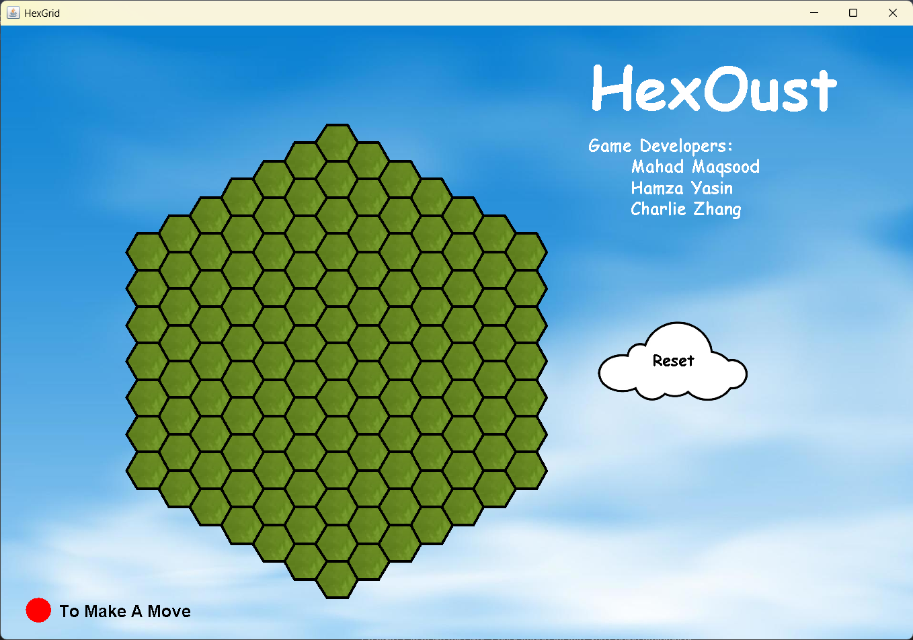

# HexOust

HexOust is a Java-based hex-grid strategy game created by a team of three:

- Charlie Zhang
- Mahad Maqsood
- Hamza Yasin

The game generates a dynamic hexagonal grid rendered over a sky-themed background with simple UI elements such as a reset button. Everything is written fully in Java.

## Running the Game

Make sure you have Java (JDK) installed.

Open a terminal inside the project folder and run:

javac HexGrid.java
java HexGrid <size> <originX> <originY>

Example (large grid):

java HexGrid 25 400 400

Argument Details:

<size>     Size of the hex grid (higher = larger hexes)
<originX>  X-coordinate where the grid starts
<originY>  Y-coordinate where the grid starts

## Project Structure

HexOust/
  HexGrid.java        // Main game logic & hex rendering
  Confetti.java       // Visual animations / effects
  Texture.jpg         // Tile texture
  sky.jpg             // Background image
  cloud.png           // Cloud graphic
  (Other helper files)

## Features

- Procedural hexagonal grid generation
- Custom rendering of textures and background
- Adjustable grid size via command-line inputs
- Reset button to regenerate the board
- Lightweight and runs anywhere Java is supported

## Screenshots

## Future Improvements

- Player interaction on grid
- More tile types or colors
- Menus / UI polish
- Exporting board images
- Animations and transitions
